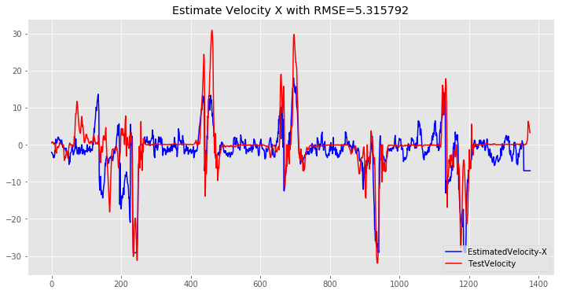
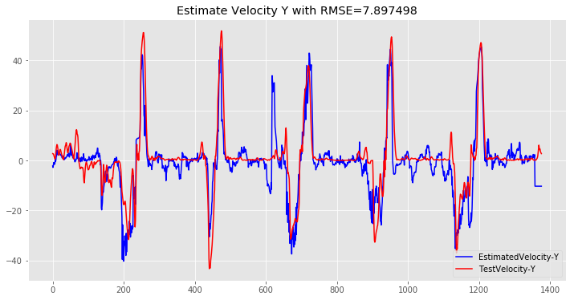
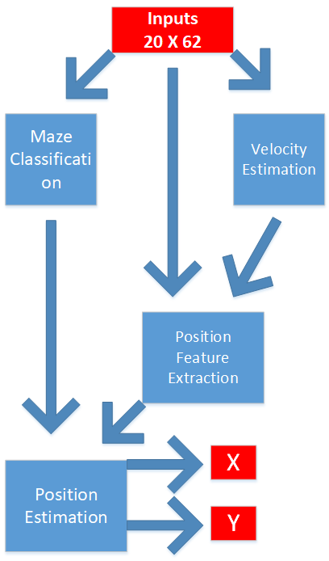

## Position Estimation Based on LSTM With 20 Timesteps (2Sec) Before 

#### Import what we need 


```python
%matplotlib inline
# %pylab osx
import tensorflow as tf
import numpy as np
import matplotlib.pyplot as plt
import scipy.io as spio
import os
import pickle
import keras
from keras.layers import *
from keras.models import *
# to produce some visualizations of our training

import IPython.display as ipyd
plt.style.use('ggplot')

```

    Using TensorFlow backend.
    

## Create Our Dataset


```python
#define 1D and 2D distance function
def distance2(p0,p1):
    
    return ((p0[0] - p1[0])**2 + (p0[1] - p1[1])**2)

def distance(p0,p1):
    
    return ((p0 - p1)**2)

###$$ GET_SPIKES_WITH_HISTORY with or without variable stride #####

def get_spikes_with_history_Stride1(neural_data,data,bins_before,bins_current=1):
    num_examples=neural_data.shape[0] #Number of total time bins we have neural data for
    num_neurons=neural_data.shape[1] #Number of neurons
    surrounding_bins=bins_before+bins_current #Number of surrounding time bins used for prediction
    X=np.empty([num_examples,surrounding_bins,num_neurons]) #Initialize covariate matrix with Na
    Y=np.zeros((num_examples,surrounding_bins,4))
    X[:] = 0
    start_idx=0
    for i in range(num_examples-bins_before): #The first bins_before and last bins_after bins don't get filled in
        end_idx=start_idx+surrounding_bins; #The bins of neural data we will be including are between start_idx and end_idx (which will have length "surrounding_bins")
        X[i,:,:]=neural_data[start_idx:end_idx,:] #Put neural data from surrounding bins in X, starting at row "bins_before"
        Y[i,:,:]=data[start_idx:end_idx,:]
        start_idx=start_idx+1
    return [X,Y]

def get_spikes_with_history(neural_data,data,bins_before,strides,bins_current=1):
    num_examples=neural_data.shape[0] #Number of total time bins we have neural data for
    num_neurons=neural_data.shape[1] #Number of neurons
    surrounding_bins=bins_before+bins_current #Number of surrounding time bins used for prediction
    X=np.empty([num_examples,surrounding_bins,num_neurons]) #Initialize covariate matrix with NaNs
    X[:] = 0
    Y=np.zeros((num_examples,surrounding_bins,4))
    
    start_idx=0
    for i in range(num_examples): #The first bins_before and last bins_after bins don't get filled in
        end_idx=start_idx+surrounding_bins; #The bins of neural data we will be including are between start_idx and end_idx (which will have length "surrounding_bins")
        X[i,:,:]=neural_data[start_idx:end_idx,:] #Put neural data from surrounding bins in X, starting at row "bins_before"
        Y[i,:,:]=data[start_idx:end_idx,:]
        start_idx=start_idx+np.int(strides[i]);
        if start_idx >= num_examples-bins_before-1:
            break
    return [X[:i],Y[:i]]

bins_before=19 #How many bins of neural data prior to the output are used for decoding
TS=bins_before+1 # Number of total timesteps that we will use in decoder model

# import data
path2='MS-100msec.mat'
mat=spio.loadmat(path2,squeeze_me=True)
x_data=mat['MSTrain'][:,1:63].astype('float32')
y_data=mat['MSTrain'][:,63:67].astype('float32')

# Calculate Min and max 
y_data2=np.zeros((y_data.shape))

yMinX=np.min(y_data[:,0],axis=0)
yMinY=np.min(y_data[:,1],axis=0)
yMaxX=np.max(y_data[:,0],axis=0)
yMaxY=np.max(y_data[:,1],axis=0)

VxMin=np.min(y_data[:,2],axis=0)
VyMin=np.min(y_data[:,3],axis=0)
VxMax=np.max(y_data[:,2],axis=0)
VyMax=np.max(y_data[:,3],axis=0)
NT=1377 ## Number Of Test
NTr=5500
#Generate for maze classification section

ArmInd=np.zeros((x_data.shape[0],4))
y=y_data
for i in range(x_data.shape[0]):
    if y[i,0] >= 165 and y[i,0] <= 200 and y[i,1] >= 60 and y[i,1] <= 165:
        ArmInd[i,1]=1
    elif y[i,0] > 200 and y[i,0] <= 240 and y[i,1] >= 60 and y[i,1] <= 165:
        ArmInd[i,2]=1
    elif y[i,0] > 240 and y[i,0] <= 265 and y[i,1] >= 60 and y[i,1] <= 165:
        ArmInd[i,3]=1
    else:
        ArmInd[i,4]=1

## Normalizing Data

y_data2[:y_data.shape[0]-NT,0]=np.divide(y_data[:y_data.shape[0]-NT,0]-yMinX,yMaxX-yMinX)
y_data2[:y_data.shape[0]-NT,1]=np.divide(y_data[:y_data.shape[0]-NT,1]-yMinY,yMaxY-yMinY)

y_data2[:y_data.shape[0]-NT,2]=np.divide(y_data[:y_data.shape[0]-NT,2]-VxMin,VxMax-VxMin)
y_data2[:y_data.shape[0]-NT,3]=np.divide(y_data[:y_data.shape[0]-NT,3]-VyMin,VyMax-VyMin)

### Create training and test data
[X_test,a]=get_spikes_with_history_Stride1(x_data[y_data.shape[0]-NT:],y_data2[y_data.shape[0]-NT:],bins_before)

[X_train,y_d]=get_spikes_with_history_Stride1(x_data[:NTr],y_data2[0:NTr],bins_before)

y_train=y_d[:NTr,0,:]

y_dd=np.concatenate([np.zeros((1,TS,4)),y_d[:NTr-1]])

y_test=y_data[y_data.shape[0]-NT:]
Arm_train=ArmInd[:NTr]
Arm_test=ArmInd[y_data.shape[0]-NT:]
print ('Train data shape: ', X_train.shape)
print ('Train labels shape: ', y_train.shape)
print ('Test data shape: ', X_test.shape)
print ('Test labels shape: ', y_test.shape)


```

    Train data shape:  (5500, 20, 62)
    Train labels shape:  (5500, 4)
    Test data shape:  (1377, 20, 62)
    Test labels shape:  (1377, 4)
    

# Maze Classifier


```python
#Create Maze classifier model
In=Input(shape=(TS,62),name='Input')
Mb=LSTM(4,return_sequences=True,name='MazeSeq')(In)
Ma=LSTM(4,activation='sigmoid',name='MazeClass')(Mb)
Mz=Model(inputs=In,outputs=Ma)
# Let's train the model using RMSprop
Mz.compile(loss={'MazeClass':'binary_crossentropy'},optimizer='rmsprop',metrics=['accuracy'])

# Create summary of model
Mz.summary()

# Training section
path='saved_models/MazeClass4.h5'
Mz.load_weights(path)
#Hist=Mz.fit(X_train,Arm_train,validation_data=(X_test,Arm_test),shuffle=True,epochs=5,verbose=1,batch_size=100)
Mz.save_weights(path)
```

    _________________________________________________________________
    Layer (type)                 Output Shape              Param #   
    =================================================================
    Input (InputLayer)           (None, 20, 62)            0         
    _________________________________________________________________
    MazeSeq (LSTM)               (None, 20, 4)             1072      
    _________________________________________________________________
    MazeClass (LSTM)             (None, 4)                 144       
    =================================================================
    Total params: 1,216
    Trainable params: 1,216
    Non-trainable params: 0
    _________________________________________________________________
    

# Velocity Estimator


```python
#Create velocity estimator model
In=Input(shape=(TS,62),name='Input')
V1=LSTM(2,return_sequences=True,name='VelocitySeq')(In)
V=LSTM(2,activation='sigmoid',name='EstimatedVelocity')(V1)
Ve=Model(inputs=In,outputs=V)
# Let's train the model using RMSprop
Ve.compile(loss={'EstimatedVelocity':'mse'},optimizer='rmsprop')

# Create summery of model
Ve.summary()
# Training section
path='saved_models/VelocityEstimator4.h5'
Ve.load_weights(path)
#Hist=Ve.fit(X_train,y_train[:,2:],shuffle=True,epochs=20,verbose=1,batch_size=100)
Ve.save_weights(path)
```

    _________________________________________________________________
    Layer (type)                 Output Shape              Param #   
    =================================================================
    Input (InputLayer)           (None, 20, 62)            0         
    _________________________________________________________________
    VelocitySeq (LSTM)           (None, 20, 2)             520       
    _________________________________________________________________
    EstimatedVelocity (LSTM)     (None, 2)                 40        
    =================================================================
    Total params: 560
    Trainable params: 560
    Non-trainable params: 0
    _________________________________________________________________
    

### analyze outputs of velocity estimator


```python
Velocity=Ve.predict(X_test)
Velocity[:,0]=np.multiply(Velocity[:,0],VxMax-VxMin)+VxMin
Velocity[:,1]=np.multiply(Velocity[:,1],VyMax-VyMin)+VyMin

### RMSE

rmsVX=np.zeros(y_test.shape[0])
rmsVY=np.zeros(y_test.shape[0])
aV=np.zeros(y_test.shape[0])
for i in range(0,y_test.shape[0]):
    rmsVX[i] = np.mean(distance(y_test[i,2], Velocity[i,0]))
    rmsVY[i] = np.mean(distance(y_test[i,3], Velocity[i,1]))
    aV[i]=distance2(y_test[i,2:], Velocity[i,:2])
rmsVX=np.sqrt(np.mean(rmsVX))
rmsVY=np.sqrt(np.mean(rmsVY))
b=np.sqrt(np.mean(aV))
print('RMSE Estmation X=%f'%rmsVX)

print('RMSE Estmation Y=%f'%rmsVY)
print('2D Distance=%f'%b)
### Plot Velocities X & Y
plt.figure(num=None, figsize=(12, 6))

plt1=plt.plot(Velocity[:,0],'b',label="EstimatedVelocity-X")


plt.plot(y_test[:,2],'r',label="TestVelocity")

plt.legend(loc=4)
plt.title('Estimate Velocity X with RMSE=%f'%rmsVX)
#plt.savefig('EstimatedTestPath-Y.png',format='png', dpi=1000,transparent=False)
plt.figure(num=None, figsize=(12, 6))

plt1=plt.plot(Velocity[:,1],'b',label="EstimatedVelocity-Y")


plt.plot(y_test[:,3],'r',label="TestVelocity-Y")

plt.legend(loc=4)
plt.title('Estimate Velocity Y with RMSE=%f'%rmsVY)
#plt.savefig('EstimatedTestPath-Y.png',format='png', dpi=1000,transparent=False)

```

    RMSE Estmation X=5.315792
    RMSE Estmation Y=7.897498
    2D Distance=9.519880
    


    Text(0.5,1,'Estimate Velocity Y with RMSE=7.897498')








# Position Estimator

Figure below shows The block diagram of LSTM based model


We used previous estimated positions as penalization terms in training loss function (some kind of feedback, but, just for loss)


```python
import keras.backend as K

# Define cost function for bouth positions
def penalized_lossY(FB,Pen,Maze):
    Pen1=(K.abs(Pen-.5))*2
    Pen2=(.5-K.abs(Pen-0.5))*2
    MI=K.argmax(Maze,axis=-1)
    def loss(y_true, y_pred):
        if MI == 4:
            return K.mean( K.square(y_pred - FB))
        else:
             return K.mean(K.square(y_pred - y_true)*Pen1 + K.square(y_pred - FB)*Pen2, axis=-1)
    return loss

def penalized_lossX(FB,Pen,Maze):
    Pen1=(K.abs(Pen-.5))*2
    Pen2=(.5-K.abs(Pen-0.5))*2
    MI=K.argmax(Maze,axis=-1)
    def loss(y_true, y_pred):
        if MI == 4 :
            return K.mean( K.square(y_pred - FB))
        else:
             return K.mean(K.square(y_pred - y_true)*Pen1 + K.square(y_pred - FB)*Pen2, axis=-1)
    return loss

# Create position estimator model
In=Input(shape=(TS,62),name='Input')
In2=Input(shape=(2,),name='FB')
V1=LSTM(2,return_sequences=True,name='VelocitySeq')(In)
Mb=LSTM(4,return_sequences=True,name='MazeSeq')(In)
V=LSTM(2,activation='sigmoid',name='EstimatedVelocity')(V1)
Pe=LSTM(4,return_sequences=True,name='PositionSeq')(In)
M=concatenate([V1,Pe,Mb],axis=-1,name='ConcatFeatures')
PYY=LSTM(1,name='firstStageOfX')(M)
Ma=LSTM(4,activation='sigmoid',name='MazeClass')(Mb)
PXX=LSTM(1,name='firstStageOfX')(M)
M2=concatenate([PXX,Ma,name='Concat_Maze_Class_With_X_Features'])
M3=concatenate([PYY,Ma,name='Concat_Maze_Class_With_Y_Features'])
PY=Dense(1,activation='sigmoid',name='EstimatedPositionY')(M3)
PX=Dense(1,activation='sigmoid',name='EstimatedPositionX')(M2)
model=Model(inputs=[In,In2],outputs=[PX,PY,V])
#Load pre-trained model weights
print(model.layers[1].get_weights()[0].shape)
print(Ve.layers[1].get_weights()[0].shape)

print(model.layers[12].get_weights()[0].shape)
print(Ve.layers[2].get_weights()[0].shape)

print(model.layers[3].get_weights()[0].shape)
print(Mz.layers[1].get_weights()[0].shape)

print(model.layers[6].get_weights()[0].shape)
print(Mz.layers[2].get_weights()[0].shape)


model.layers[1].trainable = False
model.layers[6].trainable = False
model.layers[12].trainable = False
model.layers[3].trainable = False

opt = keras.optimizers.rmsprop(lr=.001, decay=1e-6)
model.compile(loss={'EstimatedPositionX':penalized_lossX(FB=In2[:,0],Pen=V[:,0],Maze=Ma),
                    'EstimatedPositionY':penalized_lossY(FB=In2[:,1],Pen=V[:,1],Maze=Ma)},optimizer=opt)

model.layers[1].set_weights(Ve.layers[1].get_weights())
model.layers[12].set_weights(Ve.layers[2].get_weights())

model.layers[3].set_weights(Mz.layers[1].get_weights())
model.layers[6].set_weights(Mz.layers[2].get_weights())
model.summary()

# Training section
path='saved_models/PositionEstimator5.h5'
model.load_weights(path)
#Hist=model.fit([X_train,y_dd[:,0,:2]],[y_train[:,0],y_train[:,1]],shuffle=False,epochs=1,verbose=1,batch_size=25)
model.save_weights(path)
```

    (62, 8)
    (62, 8)
    (2, 8)
    (2, 8)
    (62, 16)
    (62, 16)
    (4, 16)
    (4, 16)
    

    C:\ProgramData\Anaconda3\lib\site-packages\ipykernel_launcher.py:64: UserWarning: Output "EstimatedVelocity" missing from loss dictionary. We assume this was done on purpose, and we will not be expecting any data to be passed to "EstimatedVelocity" during training.
    

    ____________________________________________________________________________________________________
    Layer (type)                     Output Shape          Param #     Connected to                     
    ====================================================================================================
    Input (InputLayer)               (None, 20, 62)        0                                            
    ____________________________________________________________________________________________________
    VelocitySeq (LSTM)               (None, 20, 2)         520         Input[0][0]                      
    ____________________________________________________________________________________________________
    PositionSeq (LSTM)               (None, 20, 4)         1072        Input[0][0]                      
    ____________________________________________________________________________________________________
    MazeSeq (LSTM)                   (None, 20, 4)         1072        Input[0][0]                      
    ____________________________________________________________________________________________________
    ConcatFeatures (Concatenate)     (None, 20, 10)        0           VelocitySeq[0][0]                
                                                                       PositionSeq[0][0]                
                                                                       MazeSeq[0][0]                    
    ____________________________________________________________________________________________________
    lstm_2 (LSTM)                    (None, 1)             48          ConcatFeatures[0][0]             
    ____________________________________________________________________________________________________
    MazeClass (LSTM)                 (None, 4)             144         MazeSeq[0][0]                    
    ____________________________________________________________________________________________________
    lstm_1 (LSTM)                    (None, 1)             48          ConcatFeatures[0][0]             
    ____________________________________________________________________________________________________
    concatenate_1 (Concatenate)      (None, 5)             0           lstm_2[0][0]                     
                                                                       MazeClass[0][0]                  
    ____________________________________________________________________________________________________
    concatenate_2 (Concatenate)      (None, 5)             0           lstm_1[0][0]                     
                                                                       MazeClass[0][0]                  
    ____________________________________________________________________________________________________
    EstimatedPositionX (Dense)       (None, 1)             6           concatenate_1[0][0]              
    ____________________________________________________________________________________________________
    EstimatedPositionY (Dense)       (None, 1)             6           concatenate_2[0][0]              
    ____________________________________________________________________________________________________
    EstimatedVelocity (LSTM)         (None, 2)             40          VelocitySeq[0][0]                
    ====================================================================================================
    Total params: 2,956
    Trainable params: 1,180
    Non-trainable params: 1,776
    ____________________________________________________________________________________________________
    

### Analyze position estimator outputs


```python
import timeit

start = timeit.default_timer()
#Get predictions
y_valid_predicted_lstm=np.zeros((y_test[:,:2].shape))
Vs=np.zeros((y_test[:,:2].shape))
y_predict=np.zeros((y_test[:,:2].shape))
FB=y_dd[-1,0,:2].reshape(1,2)
y_valid_predicted_lstm[0,:2]=FB

for i in range(TS,y_test.shape[0]):
    
    [y_valid_predicted_lstm[i,0],y_valid_predicted_lstm[i,1],Vs[i]]=model.predict([X_test[i].reshape(1,TS,62),FB.reshape(1,2)])
    FB=y_valid_predicted_lstm[i,:].reshape(1,2)

y_predict[:,0]=np.multiply(y_valid_predicted_lstm[:,0],yMaxX-yMinX)+yMinX
y_predict[:,1]=np.multiply(y_valid_predicted_lstm[:,1],yMaxY-yMinY)+yMinY


stop = timeit.default_timer()

print('test time=%f'% (stop - start) )
### calculate RMSE and 2d distance for X,Y Test path

rmsX=np.zeros(y_test.shape[0])
rmsY=np.zeros(y_test.shape[0])
a=np.zeros(y_test.shape[0])
for i in range(TS,y_test.shape[0]-TS):
    rmsX[i] = np.mean(distance(y_test[i,0], y_predict[i,0]))
    rmsY[i] = np.mean(distance(y_test[i,1], y_predict[i,1]))
    a[i]=distance2(y_test[i,:2], y_predict[i,:2])
rmsX=np.sqrt(np.mean(rmsX))
rmsY=np.sqrt(np.mean(rmsY))
b=np.sqrt(np.mean(a))
print('RMSE Estmation X=%f'%rmsX)

print('RMSE Estmation Y=%f'%rmsY)
print('2D Distance=%f'%b)
### plot and save predictions

plt.figure(num=None, figsize=(12, 6))

plt1=plt.plot(y_predict[TS:-1-TS,1],'b',label="EstimatedTestPath-Y")


plt.plot(y_test[TS:-1-TS,1],'r',label="TestPath-Y")

plt.legend(loc=4)
plt.title('Estimate position Y with RMSE=%f'%rmsY)
#plt.savefig('EstimatedTestPath-Y.png',format='png', dpi=1000,transparent=False)
plt.figure(num=None, figsize=(12, 6))

plt1=plt.plot(y_predict[TS:-1-TS,0],'b',label="EstimatedTestPath-X")


plt.plot(y_test[TS:-1-TS,0],'r',label="TestPath-X")

plt.legend(loc=4)
plt.title('Estimate position X with RMSE=%f'%rmsX)

#Save figure

#plt.savefig('EstimatedTestPath-X.png',format='png', dpi=1000,transparent=False)
```

    test time=17.137845
    RMSE Estmation X=11.730977
    RMSE Estmation Y=8.796452
    2D Distance=14.662653
    


    Text(0.5,1,'Estimate position X with RMSE=11.730977')


##Discussion

1-These undesired jumps are very high frequency we can remove most of them by using a low pass filter in the output of our model (or we can use a convolutional neural network to do that).


2- This model of position estimator have near 3,000 parameters almost One-tenth of previous one.


3- I changed a bit encoder Matlab file. So, each timestep contained of 0.1sec of spiking activity information, and we have near 9000 data sample for training and test.


