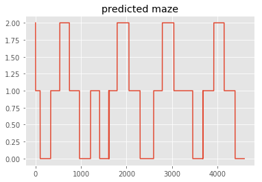
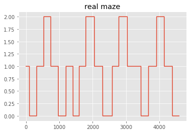
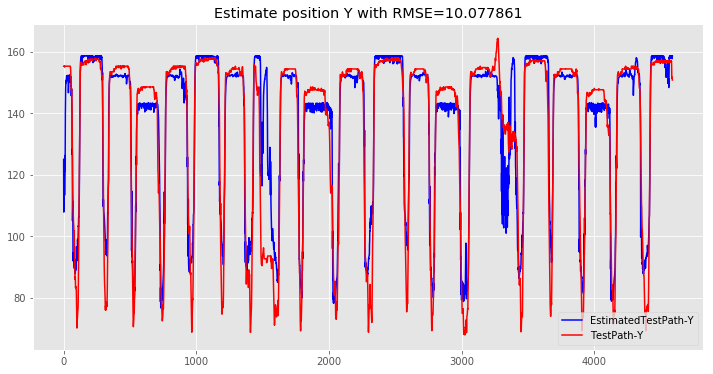
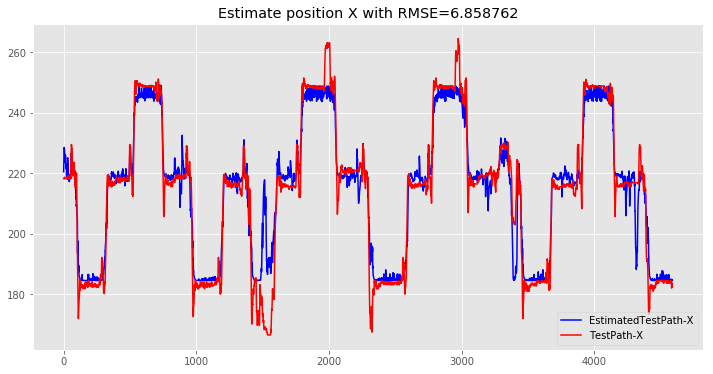

## Hierarchical LSTM For Position Estimation

### Load libs


```python
%matplotlib inline
# %pylab osx
import tensorflow as tf
import numpy as np
import matplotlib.pyplot as plt
import scipy.io as spio
import os
import pickle
import keras
from keras.layers import *
from keras.models import *
# toSequentialoduce some visualizations of our training

import IPython.display as ipyd
plt.style.use('ggplot')

```

    Using TensorFlow backend.
    

### Define distance functions


```python


#define 1D and 2D distance function
def distance2(p0,p1):
    
    return ((p0[0] - p1[0])**2 + (p0[1] - p1[1])**2)

def distance(p0,p1):
    
    return ((p0 - p1)**2)

```

### Load pretrainig data from sessions (1,2,3,5,6,7)


```python
Y=np.zeros((1,2))
X=np.zeros((1,62))
for d in [1,2,3,5,7,6]:
    path2='S%d.mat'%d
    mat=spio.loadmat(path2,squeeze_me=True)
    x_data=mat['MSTrain'][:,1:63].astype('float32')
    y_data=mat['MSTrain'][:,63:65].astype('float32')
    X=np.concatenate([X,x_data],axis=0)
    Y=np.concatenate([Y,y_data],axis=0)
```

### Create pretrainig dataset


```python
# Calculate Min and max 
y_data2=np.zeros((Y.shape))

yMinX=np.min(Y[:,0],axis=0)
yMinY=np.min(Y[:,1],axis=0)
yMaxX=np.max(Y[:,0],axis=0)
yMaxY=np.max(Y[:,1],axis=0)


#Generate for maze classification section

ArmInd=np.zeros((X.shape[0],4))
y=Y
for i in range(x_data.shape[0]):
    if y[i,0] >= 165 and y[i,0] <= 200 and y[i,1] >= 60 and y[i,1] <= 165:
        ArmInd[i,0]=1
    elif y[i,0] > 200 and y[i,0] <= 240 and y[i,1] >= 60 and y[i,1] <= 165:
        ArmInd[i,1]=1
    elif y[i,0] > 240 and y[i,0] <= 265 and y[i,1] >= 60 and y[i,1] <= 165:
        ArmInd[i,2]=1
    else:
        ArmInd[i,3]=1

## Normalizing Data

y_data2[:,0]=np.divide(Y[:,0]-yMinX,yMaxX-yMinX)
y_data2[:,1]=np.divide(Y[:,1]-yMinY,yMaxY-yMinY)

### Create training and test data

X_train=X.reshape(1,X.shape[0],62)
Arm_train=ArmInd.reshape(1,Y.shape[0],4)
print ('Train data shape: ', X_train.shape)
print ('Train labels shape: ', Arm_train.shape)


```

    Train data shape:  (1, 58805, 62)
    Train labels shape:  (1, 58805, 4)
    

### Create Maze Classifier


```python
model = Sequential()
model.add(LSTM(4, input_shape=(X_train.shape[1], 62), return_sequences=True))
model.add(TimeDistributed(Dense(4,activation='sigmoid')))
model.compile(loss='binary_crossentropy', optimizer='rmsprop',metrics=['accuracy'])
print(model.summary())
# train LSTM

```

    _________________________________________________________________
    Layer (type)                 Output Shape              Param #   
    =================================================================
    lstm_1 (LSTM)                (None, 58805, 4)          1072      
    _________________________________________________________________
    time_distributed_1 (TimeDist (None, 58805, 4)          20        
    =================================================================
    Total params: 1,092
    Trainable params: 1,092
    Non-trainable params: 0
    _________________________________________________________________
    None
    

### Classifier Pretraining 


```python
path='saved_models/MazeClassifier'
model.load_weights(path)
#model.fit(X_train, Arm_train, epochs=10, batch_size=1000, verbose=1)
model.save_weights(path)
```

### Load fine-tune data and create database


```python
# import data
path2='MS-100msec.mat'
mat=spio.loadmat(path2,squeeze_me=True)
x_data=mat['MSTrain'][:,1:63].astype('float32')
y_data=mat['MSTrain'][:,63:67].astype('float32')
# Calculate Min and max 
y_data2=np.zeros((y_data.shape))
MinX=np.min(y_data[:,0],axis=0)
MinY=np.min(y_data[:,1],axis=0)
MaxX=np.max(y_data[:,0],axis=0)
MaxY=np.max(y_data[:,1],axis=0)


NT=x_data.shape[0]//2 ## Number Of Test
NTr=x_data.shape[0]//2
#Generate for maze classification section
y_data2[:NTr,0]=np.divide(y_data[:NTr,0]-MinX,MaxX-MinX)
y_data2[:NTr,1]=np.divide(y_data[:NTr,1]-MinY,MaxY-MinY)

ArmInd=np.zeros((x_data.shape[0],4))
y=y_data
for i in range(x_data.shape[0]):
    if y[i,0] >= 165 and y[i,0] <= 200 and y[i,1] >= 60 and y[i,1] <= 165:
        ArmInd[i,0]=1
    elif y[i,0] > 200 and y[i,0] <= 240 and y[i,1] >= 60 and y[i,1] <= 165:
        ArmInd[i,1]=1
    elif y[i,0] > 240 and y[i,0] <= 265 and y[i,1] >= 60 and y[i,1] <= 165:
        ArmInd[i,2]=1
    else:
        ArmInd[i,3]=1


### Create training and test data
Arm_train=ArmInd[:NTr].reshape(1,NTr,4)
X_train=x_data[:NTr].reshape(1,NTr,62)
y_train=y_data2[:NTr].reshape(1,NTr,4)

X_test=x_data[y_data.shape[0]-NT:].reshape(1,NT,62)
Arm_test=ArmInd[y_data.shape[0]-NT:].reshape(1,NT,4)

y_test=y_data[y_data.shape[0]-NT:].reshape(1,NT,4)
print ('Train data shape: ', X_train.shape)
print ('Train labels shape: ', Arm_train.shape)
print ('Test data shape: ', X_test.shape)
print ('Test labels shape: ', Arm_test.shape)
print ('train dataP shape: ', y_train.shape)
print ('Test dataP shape: ', y_test.shape)

```

    Train data shape:  (1, 4590, 62)
    Train labels shape:  (1, 4590, 4)
    Test data shape:  (1, 4590, 62)
    Test labels shape:  (1, 4590, 4)
    train dataP shape:  (1, 4590, 4)
    Test dataP shape:  (1, 4590, 4)
    

### Fine-tune maze classifier


```python


path='saved_models/MazeClassifier'
model.load_weights(path)
#model.fit(X_train, Arm_train, epochs=10, batch_size=1000, verbose=1)
model.save_weights(path)
```

### Plot some result


```python
Maze=model.predict(X_test)
plt.plot(np.argmax(Maze[0,:,:],axis=-1))
plt.title('predicted maze')
fig=plt.figure()
plt.plot(np.argmax(Arm_test[0,:,:],axis=-1))
plt.title('real maze')
```


    Text(0.5,1,'real maze')








### Create Position Estimator with penalized loss


```python
import keras.backend as K

# Define cost function for bouth positions
def penalized_loss(Pen):
    Pen=(K.abs(Pen-0.5))*2
    def loss(y_true, y_pred):
     
        return K.mean(K.square(y_pred - y_true)*Pen , axis=-1)
    return loss

# Create position estimator model
In=Input(shape=(X_train.shape[1:]),name='Input')
Maze=LSTM(4,return_sequences=True,name='MazeSeq')(In)
Ve=LSTM(2,return_sequences=True,name='VelocitySeq')(In)
V=TimeDistributed(Dense(2,activation='sigmoid'),name='Velocity')(Ve)
M=concatenate([Maze,In,Ve],name='ConcatFeature')
Pe=LSTM(2,return_sequences=True,name='PositionSeq')(M)
Maze=TimeDistributed(Dense(4,activation='softmax'),name='Maze')(Maze)
P=TimeDistributed(Dense(2,activation='sigmoid'),name='Position')(Pe)
Model2=Model(inputs=In,outputs=[P,V,Maze])
print(model.layers[0].get_weights()[0].shape)
print(Model2.layers[1].get_weights()[0].shape)

print(model.layers[1].get_weights()[0].shape)
print(Model2.layers[7].get_weights()[0].shape)

Model2.layers[1].trainable=False
Model2.layers[7].trainable=False


Model2.compile(loss={'Velocity':'mse','Position':penalized_loss(Pen=V),'Maze':'binary_crossentropy'},
            optimizer='rmsprop',metrics={'Maze':'accuracy'})


Model2.layers[1].set_weights(model.layers[0].get_weights())
Model2.layers[7].set_weights(model.layers[1].get_weights())

# Create summary of model
Model2.summary()

```

    (62, 16)
    (62, 16)
    (4, 4)
    (4, 4)
    ____________________________________________________________________________________________________
    Layer (type)                     Output Shape          Param #     Connected to                     
    ====================================================================================================
    Input (InputLayer)               (None, 4590, 62)      0                                            
    ____________________________________________________________________________________________________
    MazeSeq (LSTM)                   (None, 4590, 4)       1072        Input[0][0]                      
    ____________________________________________________________________________________________________
    VelocitySeq (LSTM)               (None, 4590, 2)       520         Input[0][0]                      
    ____________________________________________________________________________________________________
    ConcatFeature (Concatenate)      (None, 4590, 68)      0           MazeSeq[0][0]                    
                                                                       Input[0][0]                      
                                                                       VelocitySeq[0][0]                
    ____________________________________________________________________________________________________
    PositionSeq (LSTM)               (None, 4590, 2)       568         ConcatFeature[0][0]              
    ____________________________________________________________________________________________________
    Position (TimeDistributed)       (None, 4590, 2)       6           PositionSeq[0][0]                
    ____________________________________________________________________________________________________
    Velocity (TimeDistributed)       (None, 4590, 2)       6           VelocitySeq[0][0]                
    ____________________________________________________________________________________________________
    Maze (TimeDistributed)           (None, 4590, 4)       20          MazeSeq[0][0]                    
    ====================================================================================================
    Total params: 2,192
    Trainable params: 1,120
    Non-trainable params: 1,072
    ____________________________________________________________________________________________________
    

### train model


```python
path='saved_models/PositionEstimator2.h5'
Model2.load_weights(path)
Hist=Model2.fit(X_train,[y_train[:,:,:2],y_train[:,:,2:],Arm_train],shuffle=False,epochs=5,verbose=1,batch_size=1000)
Model2.save_weights(path)
```

    Epoch 1/5
    1/1 [==============================] - 8s - loss: 0.1507 - Position_loss: 0.0019 - Velocity_loss: 0.0361 - Maze_loss: 0.1126 - Maze_acc: 0.9888
    Epoch 2/5
    1/1 [==============================] - 6s - loss: 0.1492 - Position_loss: 0.0018 - Velocity_loss: 0.0357 - Maze_loss: 0.1117 - Maze_acc: 0.9888
    Epoch 3/5
    1/1 [==============================] - 6s - loss: 0.1482 - Position_loss: 0.0018 - Velocity_loss: 0.0353 - Maze_loss: 0.1111 - Maze_acc: 0.9889
    Epoch 4/5
    1/1 [==============================] - 6s - loss: 0.1474 - Position_loss: 0.0017 - Velocity_loss: 0.0350 - Maze_loss: 0.1106 - Maze_acc: 0.9889
    Epoch 5/5
    1/1 [==============================] - 6s - loss: 0.1466 - Position_loss: 0.0017 - Velocity_loss: 0.0348 - Maze_loss: 0.1101 - Maze_acc: 0.9889
    

### Analyze position estimator estimator


```python
import timeit
y_predict=np.zeros((y_test.shape[1],2))
start = timeit.default_timer()
#X_test[0,:1100]=np.zeros((1,62))
#X_test[0,1300:]=np.zeros((1,62))
[y_valid_predicted_lstm,Vs,Maze]=Model2.predict(X_test)

y_predict[:,0]=np.multiply(y_valid_predicted_lstm[0,:,0],MaxX-MinX)+MinX
y_predict[:,1]=np.multiply(y_valid_predicted_lstm[0,:,1],MaxY-MinY)+MinY


stop = timeit.default_timer()

print('test time=%f'% (stop - start) )
### calculate RMSE and 2d distance for X,Y Test path

rmsX=np.zeros(y_test.shape[1])
rmsY=np.zeros(y_test.shape[1])
a=np.zeros(y_test.shape[1])
for i in range(y_test.shape[1]):
    rmsX[i] = np.mean(distance(y_test[0,i,0], y_predict[i,0]))
    rmsY[i] = np.mean(distance(y_test[0,i,1], y_predict[i,1]))
    a[i]=distance2(y_test[0,i,:2], y_predict[i,:2])
rmsX=np.sqrt(np.mean(rmsX))
rmsY=np.sqrt(np.mean(rmsY))
b=np.sqrt(np.mean(a))
print('RMSE Estmation X=%f'%rmsX)

print('RMSE Estmation Y=%f'%rmsY)
print('2D Distance=%f'%b)
### plot and save predictions

plt.figure(num=None, figsize=(12, 6))

plt1=plt.plot(y_predict[:,1],'b',label="EstimatedTestPath-Y")


plt.plot(y_test[0,:,1],'r',label="TestPath-Y")

plt.legend(loc=4)
plt.title('Estimate position Y with RMSE=%f'%rmsY)
#plt.savefig('EstimatedTestPath-Y.png',format='png', dpi=1000,transparent=False)
plt.figure(num=None, figsize=(12, 6))

plt1=plt.plot(y_predict[:,0],'b',label="EstimatedTestPath-X")


plt.plot(y_test[0,:,0],'r',label="TestPath-X")

plt.legend(loc=4)
plt.title('Estimate position X with RMSE=%f'%rmsX)

#Save figure

#plt.savefig('EstimatedTestPath-X.png',format='png', dpi=1000,transparent=False)
```

    test time=0.737775
    RMSE Estmation X=6.858762
    RMSE Estmation Y=10.077861
    2D Distance=12.190402
    


    Text(0.5,1,'Estimate position X with RMSE=6.858762')







